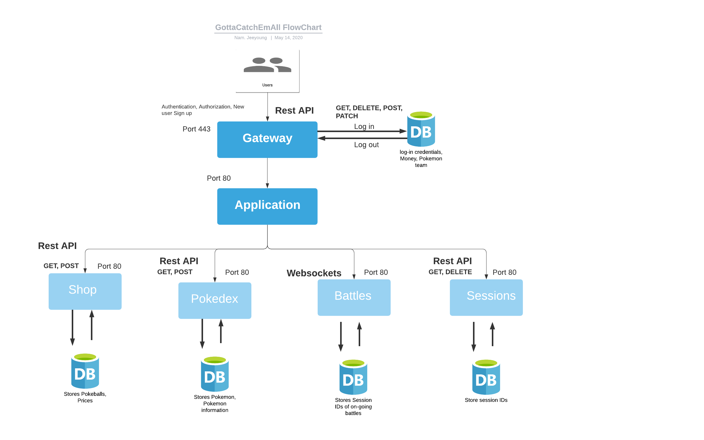

# Project Description
Nam Pham, Jeeyoung Kim (INFO 441)

### Non-technical Description of the project
We want to create a platform in which people can play a Pokémon battle with friends or players who match their rankings. Main features of this game are the following:  
* Players can catch a Pokemon, allowing them to feel a sense of ownership.
* By catching Pokemon, they can add it to their dex and their team
* Players can earn money by winning in a battle, which allows them to buy pokeballs to store a Pokemon they catch.  
* Players can choose which Pokemon to play with and which moves to use.
* Players can hover over each Pokemon and see their types, moves, accuracy, and statistics.

*We think developing game logic and generating battles would be the most challenging part*

The target audience of our application is anyone who enjoys gaming or anyone who misses hanging out with their friends. Additionally, there is a frustration regarding currently existing Pokemon games that prevent users from storing Pokemon that they caught by winning in a battle. With our application, players can store Pokemon that they caught and view their information in Pokedex.

We want to create this application because we want to help those around us stay connected and entertained. Due to the time being, there is uncertainty and anxiety which makes some of us deal with immense amounts of stress. Social distancing prevents us from interacting with others and spending time with friends and family that we used to. This can take a huge toll on people’s mental health by creating a sense of isolation. For this reason, we want to build a pokemon game that everyone knows and enjoys and may remind people of good old days.

### Technical Description

### API Documentation
GET /v1/pokedex

returns all the pokemon and if they are caught by the user or not like this example:

response type = {
>"bulbasaur": false,
    >"ivysaur": false,
    >"venusaur": false,
    ...

}
Possible return status: 
200 (OK)
401 (Unauthorized)
500 (Internal Server Error)

GET /v1/pokedex/{pokemonName}
returns the information of the pokemon if they are caught by the user. For example:
{
    "dexNumber": 46,
    "name": "Paras",
    "types": [
        "Bug",
        "Grass"
    ],
    "desc": "Burrows to suck tree roots. The mushrooms on its back grow by drawing nutrients from the bug host.",
    "baseStats": {
        "hp": 35,
        "atk": 70,
        "def": 55,
        "spa": 45,
        "spd": 55,
        "spe": 25
    },
    "abilities": {
        "0": "Effect Spore",
        "1": "Dry Skin",
        "H": "Damp"
    },
    "height": 0.3,
    "weight": 5.4,
    "evolvesTo": [
        "Parasect"
    ],
    "eggGroups": [
        "Bug",
        "Grass"
    ],
    "catchRate": 190
}
Possible return status:
200 (OK)
400 (User never caught this pokemon but still requested it/ bad pokemon request)
401 (Unauthorized)

GET /v1/pokedex/image/{pokemonName}
returns the image of the requested pokemon as a png
Possible return status:
200 (OK)
400 (no image found from the query parameter)

GET /v1/encounter
player encounter a pokemon so that they can catch it. Until the player run away/ catch said pokemon you will
keep encountering the same pokemon. Each pokemon has a different rarity, the lower the rarity the harder it is to encounter said pokemon. For example:
{
    pokemonName: "chansey"
    rarity: "ultra_rare"
}
Possible return status:
200 (OK)
401 (Unauthorized)
500 (Internal Server Error)

GET /v1/runaway
player run away from a pokemon, removing themselves from any encounters they may have had.
Possible return status:
200 (OK)
400 (Not already in encounter with any pokemon)
401 (Unauthorized)
500 (Internal Server Error)

GET /v1/catch/{pokemonName}
player tries to catch a pokemon. Remove player from any encounter if they succeed
{
    status: "success" / "failed",
    msg: depending on if they success/ fail + reason why they fail this specific catch (not in encounter with any pokemon/ already in encounter with a different pokemon, catching fail normally)
}
Possible return status:
200 (OK (either catch fail normally or catch successfully))
400 (Not in encounter with any pokemon/ in a different encounter)
401 (Unauthorized)

GET /v1/inventory
show the current inventory the player has. Right now only support different types of balls
response type = {
    "pokeball": 100,
    "greatball": 100,
    ...
}
Possible return status:
200 (OK)
401 (Unauthorized)
500 (Internal Server Error)

GET /v1/items/balls/{ballName} 
show the details of a certain type of ball. For example:
{
    "itemName": "Poke Ball",
    "desc": "A device for catching wild Pokémon. It's thrown like a ball, comfortably encapsulating its target.",
    "catchRateMultiplier": 1,
    "price": 200
}
Possible return status:
200 (OK)
401 (Unauthorized)
400 (Bad request/ query parameter)

GET /v1/items/image/{itemName}
returns the image of the requested ball as a png
Possible return status:
200 (OK)
400 (no image found from the query parameter)

GET /v1/team
show all the pokemon the current user has caught
Possible return status:
200 (OK)
401 (Unauthorized)
500 (Internal Server Error)

GET /v1/team/{pokemonID}
show the specific pokemon of a user
Possible return status:
200 (OK)
400 (User does not have the pokemon)
401 (Unauthorized)
500 (Internal Server Error)

POST /v1/team/{pokemonID}
change the nickname of a pokemon in your team: 
{
    nickName: newName
}
Possible return status:
200 (OK)
400 (User does not have the pokemon)
401 (Unauthorized)
500 (Internal Server Error)

### Summary of User Table
|Priority| User | Description | Technical implementation strategy |
| :------------- | :------------- | :------------- |:------------- |
|P0| As a player |As a player, I want to play games with my friends. |Search for username using GET request and send a battle request if  the username is matched. Upon clicking the battle request, a battle ensues. Store sessions in sql database.|
|P0| As a player |As a user, I want to be able to log in to my account and continue where I left off. | Store log in credentials in database, authenticate user and store sessions inside Redis database.|
|P2| As a player |As a user, I want to take a personality test and find a pokemon that matches my personality. | |
|P0| As a player |As a user, I expect the game to execute the moves I chose correctly. | Send over move details through WebSockets, and update the game state in the backend, accordingly and send back data to both clients.|
|P1| As a player |As a user, I want the game to show my rankings. |MySQL Database that stores rankings, pull from the db and update status. After the game is over, update the ranking based on the result.|
|P0| As a player |As a user, I want to catch as many pokemons as I can using the Pokeball I bought from the shop.| |
|P1| As a player | As a user, I want to collect as much money as possible by completing missions and winning in games so that I can buy more pokeballs. |Create a microservice to update and store user’s win-loss records, connect to another microservice to store and update users’ money. |
|P1| As a player |As a player, I want to see my Pokemon’s stat, as well as the types, power, and accuracy of their moves.|GET request to fetch Pokemon’s data.|
|P0| As a player |As a player, I want to look for a random player that matches my ranking in a reasonable amount of time and play games. |User pool, randomly assign, if match is found, remove users from the queue and start a new session.|
|P0| As a player |As a player, I want to be able to buy Pokeball from the shop using money I earned from battle|PATCH request to the sql database to deduct money. |
