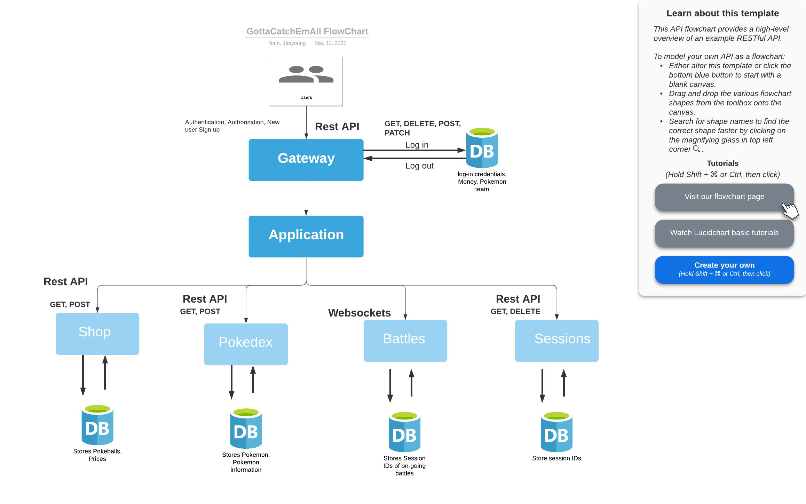

# Project Description
Nam Pham, Jeeyoung Kim (INFO 441)

### Non-technical Description of the project
We want to create a platform in which people can play a Pokémon battle with friends or players that match their rankings. Main features of this game are following:  
* Players can play with friends or random players of similar ranking.
* Players can catch a pokemon by winning in a battle, allowing them to feel a sense of ownership.
* Players can earn money by winning in a battle, which allows them to buy pokeballs to store a pokemon they catch.  
* Players can choose which pokemon to play with and which moves to use.
* Players can hover over each pokemon and see their types, moves, accuracy, and statistics.

Due to the time being, there is uncertainty and anxiety which makes some of us deal with immense amounts of stress. Furthermore, social distancing prevents us from interacting with others and spending time with friends and family that we used to. This can take a huge toll on people’s mental health by creating a sense of isolation. For that reason, we want to build a game that everyone knows and enjoys and may remind people of the good old days.
### Technical Description

### Summary of User Table
table goes here
