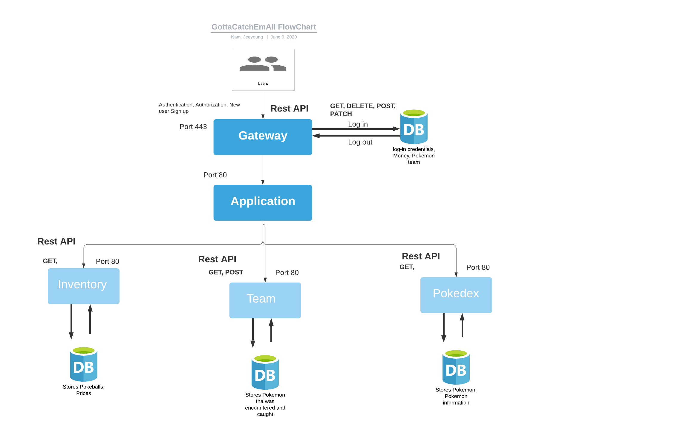

# Project Description
Nam Pham, Jeeyoung Kim (INFO 441)

### Non-technical Description of the project
We want to create a platform in which people can play a Pokémon battles to catch pokemon and view pokemon's statistics. Main features of this game are the following:  
* Players can catch a Pokemon using pokeballs they have, allowing them to feel a sense of ownership.
* By catching Pokemon, they can add it to their dex and their team
* Players can earn money by winning in a battle, which allows them to buy pokeballs to store a Pokemon they catch.  
* Players can hover over each Pokemon and see their types, moves, accuracy, and statistics.

*We think developing game logic and generating battles would be the most challenging part* 

The target audience of our application is anyone who enjoys gaming. Additionally, there is a frustration regarding currently existing Pokemon games that prevent users from storing Pokemon that they caught by winning in a battle. With our application, players can store Pokemon that they caught and view their information in Pokedex.

We want to create this application because we want to help those around us stay entertained. Due to the time being, there is uncertainty and anxiety which makes some of us deal with immense amounts of stress. Social distancing prevents us from interacting with others and spending time with friends and family that we used to. This can take a huge toll on people’s mental health by creating a sense of isolation. For this reason, we want to build a pokemon game that everyone knows and enjoys and may remind people of good old days.

### Technical Description

### Summary of User Table
|Priority| User | Description | Technical implementation strategy |
| :------------- | :------------- | :------------- |:------------- |
|P0| As a player |As a user, I want to be able to log in to my account and continue where I left off. | Store log in credentials in database, authenticate user and store sessions inside Redis database.|
|P2| As a player |As a user, I want to take a personality test and find a pokemon that matches my personality. | |
|P0| As a player |As a user, I expect the game to execute the moves I chose correctly. | Send over move details through WebSockets, and update the game state in the backend, accordingly and send back data to both clients.|
|P1| As a player |As a user, I want the game to show my rankings. |MySQL Database that stores rankings, pull from the db and update status. After the game is over, update the ranking based on the result.|
|P0| As a player |As a user, I want to catch as many pokemons as I can using the Pokeball I bought from the shop.| |
|P1| As a player | As a user, I want to collect as much money as possible by completing missions and winning in games so that I can buy more pokeballs. |Create a microservice to update and store user’s win-loss records, connect to another microservice to store and update users’ money. |
|P1| As a player |As a player, I want to see my Pokemon’s stat, as well as the types, power, and accuracy of their moves.|GET request to fetch Pokemon’s data.|
|P0| As a player |As a player, I want to look for a random player that matches my ranking in a reasonable amount of time and play games. |User pool, randomly assign, if match is found, remove users from the queue and start a new session.|
|P0| As a player |As a player, I want to be able to buy Pokeball from the shop using money I earned from battle|PATCH request to the sql database to deduct money. |
